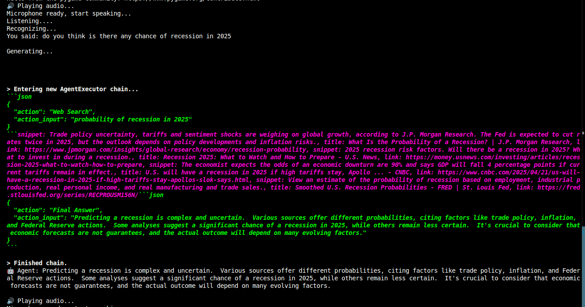
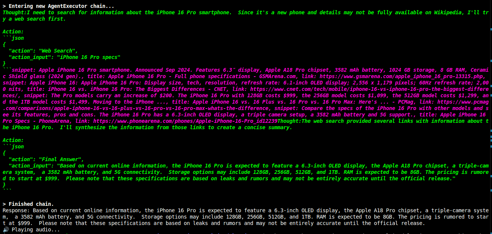
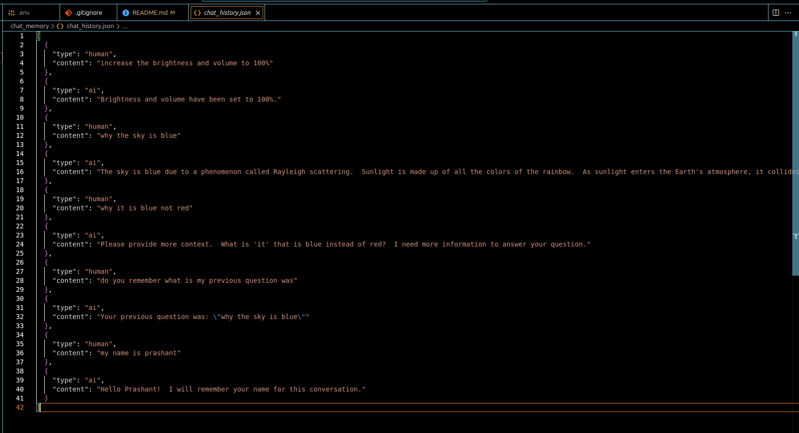

# 🧠 LangChain Voice Assistant

A powerful Multimodel voice-enabled AI assistant built using Python, LangChain, google-gemini and llama2:latest. It listens to your speech, understands your question, and responds with a natural-sounding voice — just like a real assistant, It also has tools to perform different actions just my giving the voice command

---

## 🚀 Demo

### 🎤 **Voice Command Demo**

  
*This image shows the assistant processing a voice command and performing the requested task (like opening an app, answering a query, etc.).*

---

### 🔧 **Tool Integration Demo**

  
*Click the image above to watch the demo of the assistant integrating with different tools like web search, weather info, and more.*

---

### 🧠 **Memory Demo**

  
*This image shows the assistant's memory feature in action, remembering previous interactions.*

---

### 📹 **Complete Operation Video**

[](assets/videos/complete_operation_demo.mp4)  
*Click the image above to watch the complete operation of the voice assistant in action.*

---

## 🚀 Features

- 🎤 **Voice Input**: Speak(Hindi/English) directly into your microphone — no typing needed!
- 🤖 **Smart AI Response**: Uses Goole-gemini and llama2 as LLM to answer questions, search Wikipedia, and perform tasks.
- 📢 **Text-to-Speech Output**: Responds in a natural-sounding voice using `pyttsx3` with custom function.
- 🔗 **LangChain Integration**: Combines tools and agents to access real-time knowledge and context.
- 🔄 **Memory Support**: Remembers previous user queries during the session.
- 🧩 **Custom Tools**: Includes tools like Wikipedia search, time checker, weather info, change volume/brightness and more.
- 🧊 **Offline Speech-to-Text Option**: Fast recognition with speech recognizer and Google Translate for language processing.

---

## 🧠 LLM Used

- **Model**: Used open source model like Deepseek or Llama2 and paid google's gemini  (Configurable via LangChain)
- **Chain Type**: Zero-shot-react-description agent with tool integration
- **Tools Integrated**: Wikipedia, Time, Calculator, YouTube search, weather info etc. (customizable)

---

## 🗣️ Speech Recognition

- **Primary Engine**: Python's `speech_recognition` and `googletrans` for speech-to-text (online fallback)
- **Usage**: Captures live microphone input, converts speech to text in real-time

---

## 🔊 Text-to-Speech (TTS)

- **Default Engine**: Using voice of Brian (Jarvis) via a free online converter (very fast)
- **Optional Modern Voice**: Other free-to-use models like `pyttsx3`
- **Feature**: Continuously speaks assistant responses, one query at a time

---

## 🧰 Tools and Their Functions

| Tool Name             | Function                                                                 |
|-----------------------|--------------------------------------------------------------------------|
| **Time**              | Get the current time and date                                            |
| **Wikipedia**         | Search and summarize information from Wikipedia                          |
| **Web Search**        | Get real-time web results for a given topic                              |
| **YouTube**           | Search YouTube and return video links                                    |
| **Weather**           | Get weather information like temperature, wind, etc.                     |
| **Generate Llama Answer** | Generate creative responses like poems, jokes, and math solutions using Llama2 |
| **Open App**          | Open installed applications (e.g., Chrome, VS Code, Terminal, etc.)      |
| **Close App**         | Close running applications by name                                       |
| **Change Volume**     | Set the system volume to a specific percentage (0–100%)                  |
| **Set Brightness**    | Adjust screen brightness by percentage (0–100%)                          |

---

## ⚙️ Installation Guide

Follow the steps below to set up and run the LangChain Voice Assistant on your local machine:

---

### 1️⃣ Install Python

Make sure you have **Python 3.9+** installed. You can download it from [python.org](https://www.python.org/downloads/).

Check your Python version:
```bash
python --version
```

### 1. Clone the Repository

```bash
git clone https://github.com/Prashant1510/AI-Agent-.git
cd AI-Agent-
```

### 2. Create and Activate Virtual Environment

```bash
python -m venv .venv
source .venv/bin/activate
```

### 3. Install Dependencies

```bash
pip install -r requirements.txt
```

### 4. Add Google API Key to .env File

GOOGLE_API_KEY=your_google_api_key_here

### 5. Run the Project

```bash
python main.py
```
---

## 📬 Contact

Feel free to reach out if you have any questions or feedback:

[](https://www.linkedin.com/in/prashant1510/)

---

## ⚠️ Requirements

> **Note**: You can run the program on **CPU**, but it requires a minimum of **16 GB RAM** and processors like **Ryzen 7** or **Intel i7 and above**.  
> A **GPU** will significantly boost performance if available.